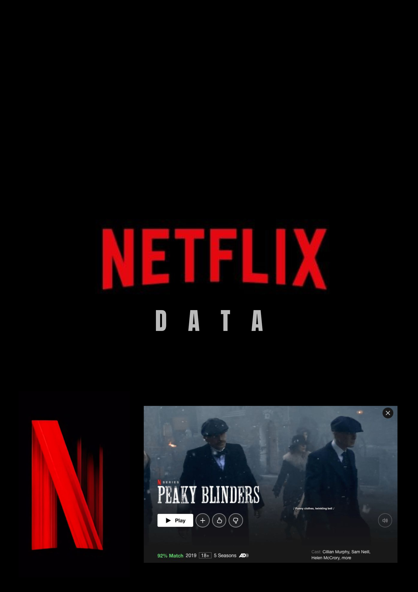

# 🎬📊 Netflix Data Pipeline - ETL & Analytics Project 🚀✨

<p align="center">
  
</p>

<p align="center">
  <em>Incremental ETL magic — fake Netflix data 𝗡, pandas 🐼 + Snowflake ❄️, updated row by row!</em>
</p>

---

## 📋🎯 Project Overview

This project is a **complete data engineering pipeline** that extracts, transforms, and loads Netflix movie/TV show data into a modern data warehouse. It's designed as an **incremental data pipeline** that can handle ongoing data updates efficiently! 🎉

### 🎯✨ What This Project Does

1. **📥🔍 Extracts** Netflix data from multiple messy CSV files
2. **🧹✨ Cleans & Transforms** the data (fixes typos, standardizes formats, handles missing values)
3. **📊❄️ Loads** clean data into Snowflake data warehouse
4. **🔍✅ Validates** data quality using dbt with comprehensive tests
5. **⚡🔄 Processes** data incrementally (only new/updated records)

## 🏗️🎨 Architecture

```
Raw CSV Files → Python ETL → Snowflake → dbt Models → Analytics Ready Data
     📁📄              🐍🐍           ❄️❄️         🔧⚙️              📈📊
```

## 🚀🎮 Quick Start

### 📋✅ Prerequisites
- 🐍 Python 3.8+
- ❄️ Snowflake account
- 🔧 dbt CLI

### 🛠️⚙️ Installation

1. **📥📂 Clone the repository**
   ```bash
   git clone <your-repo-url>
   cd Netflix_data
   ```

2. **📦⬇️ Install dependencies**
   ```bash
   pip install -r requirements.txt
   ```

3. **🔐⚙️ Set up environment variables**
   Create a `.env` file in the root directory:
   ```env
   # 🎬📁 Netflix Data Files
   NETFLIX_FILE1=data/raw_data/netflix_messy_part1.csv
   NETFLIX_FILE2=data/raw_data/netflix_messy_part2.csv
   NETFLIX_FILE3=data/raw_data/netflix_messy_part3.csv

   # ❄️🔐 Snowflake Configuration
   SNOWFLAKE_USER=your_username
   SNOWFLAKE_PASSWORD=your_password
   SNOWFLAKE_ACCOUNT=your_account
   SNOWFLAKE_WAREHOUSE=your_warehouse
   SNOWFLAKE_DATABASE=your_database
   SNOWFLAKE_SCHEMA=your_schema
   SNOWFLAKE_ROLE=your_role
   SNOWFLAKE_TABLE=NETFLIX
   ```

4. **▶️🚀 Run the ETL Pipeline**
   ```bash
   python etl_main.py
   ```

5. **🔧⚙️ Run dbt models**
   ```bash
   cd dbt_project
   dbt run
   dbt test
   ```

## 📁🗂️ Project Structure

```
Netflix_data/
├── 📁📂 data/
│   ├── 📁📄 raw_data/          # 🗑️💩 Original messy CSV files
│   └── 📁✨ cleaned_data/      # 🧹✨ Processed clean files
├── 📁🐍 etl_python/           # 🐍⚙️ ETL pipeline modules
│   ├── 📄📥 extract.py           # 📥🔍 Data extraction logic
│   ├── 📄🔄 transform.py         # 🧹✨ Data cleaning & transformation
│   └── 📄📤 load.py              # ❄️📊 Snowflake loading
├── 📁🔧 dbt_project/          # 🔧⚙️ dbt data modeling
│   ├── 📁📊 models/              # 📊🔧 dbt models & tests
│   ├── 📁⚙️ macros/              # ⚙️🔧 Custom dbt macros
│   └── 📄⚙️ dbt_project.yml      # ⚙️🔧 dbt configuration
├── 📁🖼️ images/               # 📸📊 Before/after screenshots
├── 📄🚀 etl_main.py              # 🚀⚙️ Main ETL orchestrator
├── 📄📦 requirements.txt         # 📦⬇️ Python dependencies
└── 📄📖 README.md               # 📖✨ This file
```

## 🔧✨ Features

### 🧹✨ Data Cleaning & Transformation
- ✅ **🎬📝 Title Standardization**: Fixes typos, removes special characters
- ✅ **🎭🎨 Genre Normalization**: Corrects misspellings, fills missing values
- ✅ **⏱️🔄 Duration Conversion**: Converts various formats to minutes
- ✅ **🌍🗺️ Country Standardization**: Fixes country name typos
- ✅ **⭐📊 Rating Validation**: Standardizes rating formats
- ✅ **📅📆 Date Processing**: Converts dates to proper formats

### 🔍✅ Data Quality & Testing
- ✅ **🧪🔬 Comprehensive Tests**: 15+ data quality tests
- ✅ **❌🚫 Null Checks**: Ensures no missing critical data
- ✅ **📊📈 Range Validation**: Validates year ranges, scores
- ✅ **📋✅ Format Validation**: Ensures proper data formats
- ✅ **🔑🔒 Uniqueness Tests**: Prevents duplicate records

### ⚡🔄 Incremental Processing
- ✅ **🧠⚡ Smart Loading**: Only processes new data
- ✅ **🚀💨 Efficient Updates**: Avoids full data refresh
- ✅ **🔒🚫 Duplicate Prevention**: Uses unique keys
- ✅ **⚡📊 Performance Optimized**: Handles large datasets

## 📊📋 Data Schema

| Column | Type | Description | Tests |
|--------|------|-------------|-------|
| `🎬🆔 MOVIE_ID` | String | Unique identifier | Not null, Unique |
| `🎬📝 TITLE` | String | Movie/TV show title | Not null |
| `🎬📺 TYPE` | String | Movie or TV Show | Not null, Accepted values |
| `📅📆 RELEASE_YEAR` | Integer | Release year | Not null, Range 1960-2023 |
| `🎭🎨 GENRE` | String | Primary genre | Not null |
| `⏱️📊 DURATION_MINUTES` | Integer | Duration in minutes | Not null, Positive |
| `🌍🗺️ COUNTRY` | String | Country of origin | Not null |
| `⭐📊 RATING` | String | Content rating | Not null, Accepted values |
| `⭐📈 IMDB_SCORE` | Float | IMDb rating | Not null, Non-empty |
| `📅➕ ADDED_DATE` | Date | Date added to dataset | Not null |

## 🎮💻 Usage Examples

### 🚀▶️ Run Complete Pipeline
```bash
# 🐍🚀 Run ETL pipeline
python etl_main.py

# 🔧⚙️ Run dbt models
cd dbt_project
dbt run

# 🧪✅ Run data quality tests
dbt test
```

### 🔍✅ Check Data Quality
```bash
cd dbt_project
dbt test --select test_type:singular
```

### 👀📊 View Data in Snowflake
```sql
SELECT * FROM your_database.your_schema.NETFLIX_INCREMENTAL
WHERE RELEASE_YEAR >= 2020
ORDER BY IMDB_SCORE DESC;
```

## 📈📊 Monitoring & Logging

- **📝📋 Detailed Logs**: All operations are logged with timestamps
- **⚠️🚨 Error Handling**: Comprehensive error catching and reporting
- **📊📈 Progress Tracking**: Real-time pipeline progress updates
- **🔍✅ Data Validation**: Automatic data quality checks

## 🛠️🔧 Troubleshooting

### ❌🚨 Common Issues

1. **❄️🔌 Snowflake Connection Failed**
   - 🔐✅ Check your `.env` file credentials
   - 🔍✅ Verify Snowflake account access

2. **📊❌ Data Loading Errors**
   - 📁✅ Check CSV file paths in `.env`
   - 🔐✅ Verify file permissions

3. **🧪❌ dbt Test Failures**
   - 🔍📊 Review data quality issues
   - ⚙️✅ Check test configurations


## 🎉🙏 Acknowledgments

- 🎬📺 Netflix for the dataset
- ❄️❄️ Snowflake for the data warehouse
- 🔧⚙️ dbt for data transformation
- 🐍🐍 Python community for amazing libraries

---
